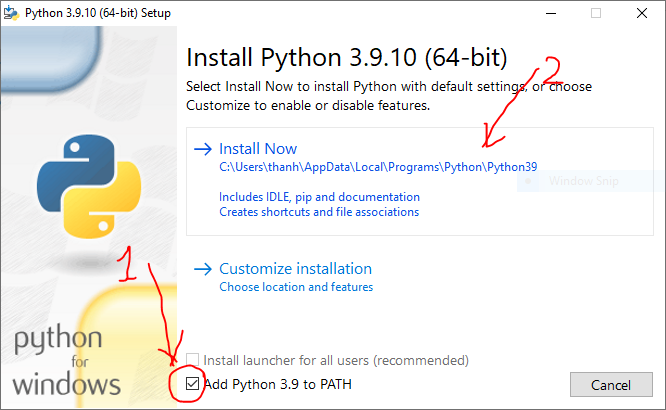
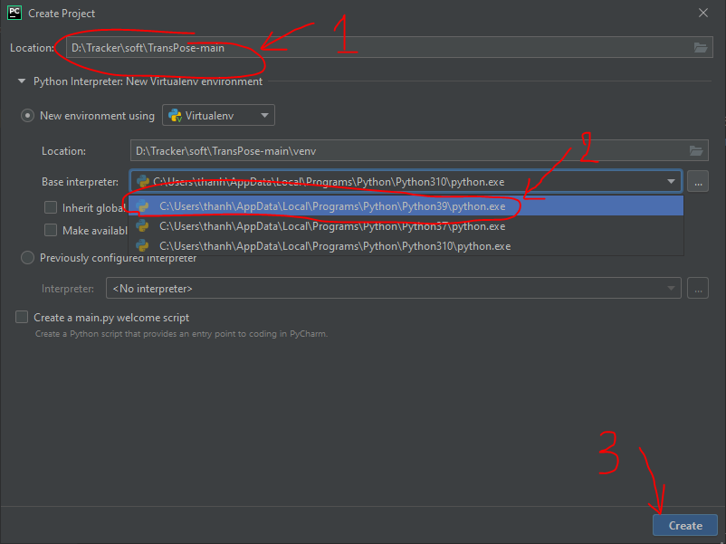
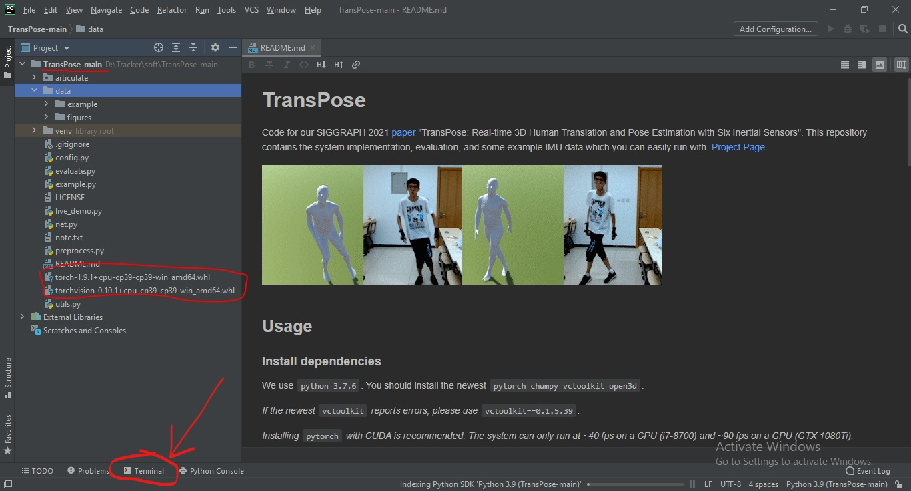
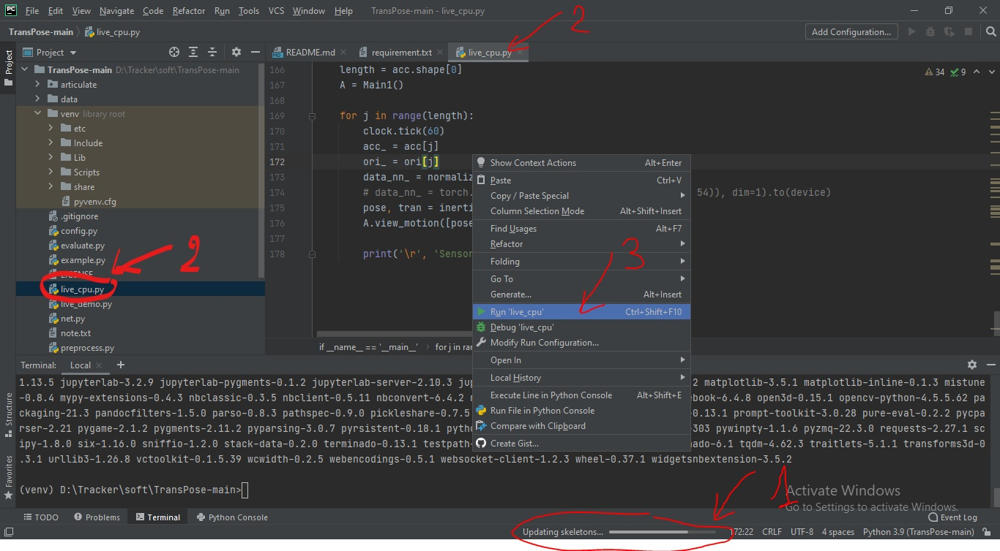

# Tutorial

This tutorial installs Pytorch using CPU, the installation takes about 1 hour

## Download

Pycharm IDE [here](https://www.jetbrains.com/pycharm/download/download-thanks.html?platform=windows&code=PCC)

Python 3.9.10 version [here](https://www.python.org/ftp/python/3.9.10/python-3.9.10-amd64.exe)

Torch cpu 1.9.1 [here](https://download.pytorch.org/whl/cpu/torch-1.9.1%2Bcpu-cp39-cp39-win_amd64.whl)

Torch vision [here](https://download.pytorch.org/whl/cpu/torchvision-0.10.1%2Bcpu-cp39-cp39-win_amd64.whl)

Transpose Project branch SlimeVRX [here](https://github.com/SlimeVRX/TransPose/archive/refs/heads/main.zip)

Note: Pytorch and Python versions must match, must be Python version 3.9
## Install

1. Install Pycharm

2. Install Python 3.9.10

   - Add PATH

3. Create project pycharm

   - Unzip the project
   - Enter the address in the Location field
   - Select Python 3.9.10 version
   - Create

4. Open terminal

   - Copy torch-1.9.1+cpu-cp39-cp39-win_amd64.whl and torchvision-0.10.1+cpu-cp39-cp39-win_amd64.whl to github project folder
   - Click Terminal (install Python library)
   - Type
     - `pip install "torch-1.9.1+cpu-cp39-cp39-win_amd64.whl"`
     - `pip install "torchvision-0.10.1+cpu-cp39-cp39-win_amd64.whl"`
     - `pip install -r requirement.txt`

5. Run live_cpu.py

   - Status bar check is done
   - Click live_cpu.py
   - Right-click on the screen select [Run 'live_cpu']
